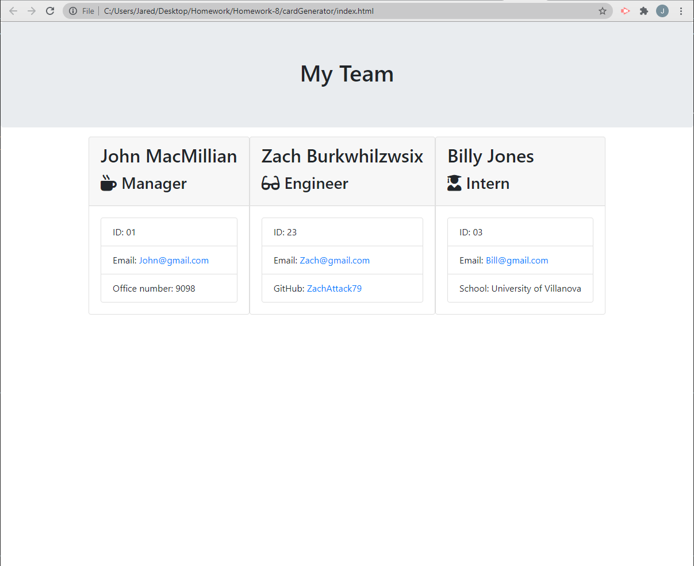

# cardGenerator

## This project was built with node, inquirer, and jest for testing

# Installation
#### run npm install 

# Questions
[https://www.github.com](https://www.github.com)
[Walkthrough Video](https://www.example.com)

